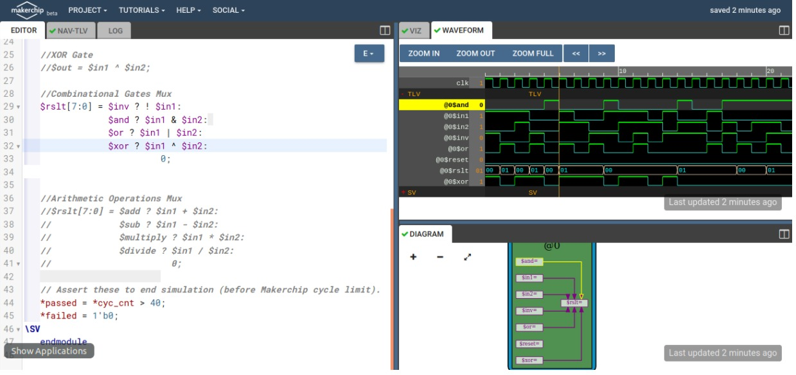
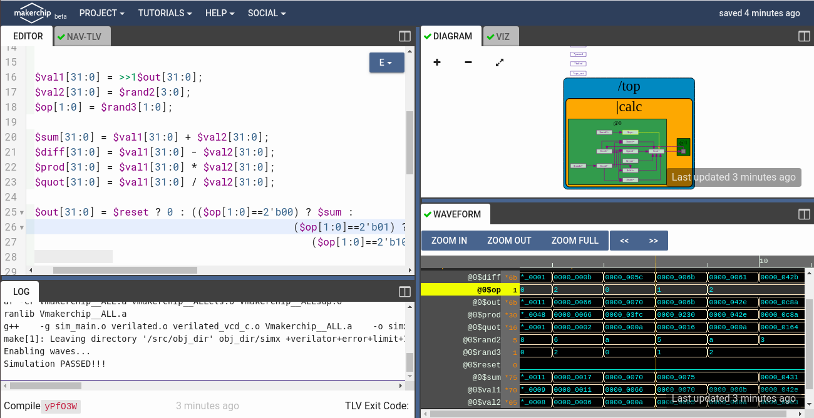
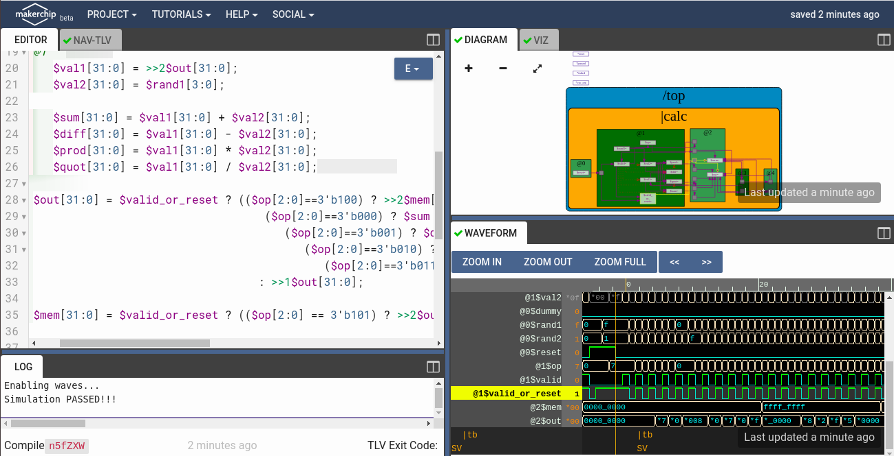
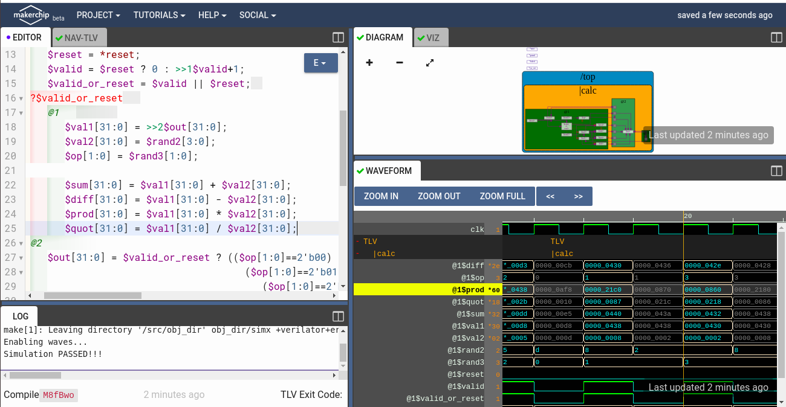
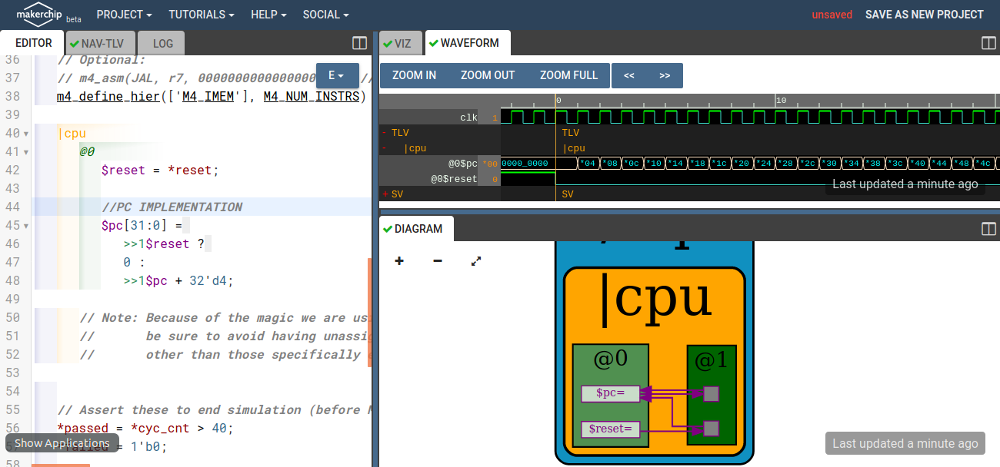
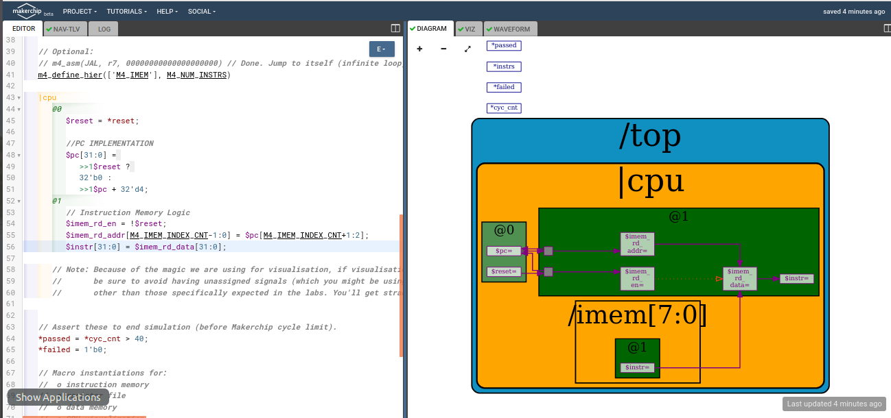
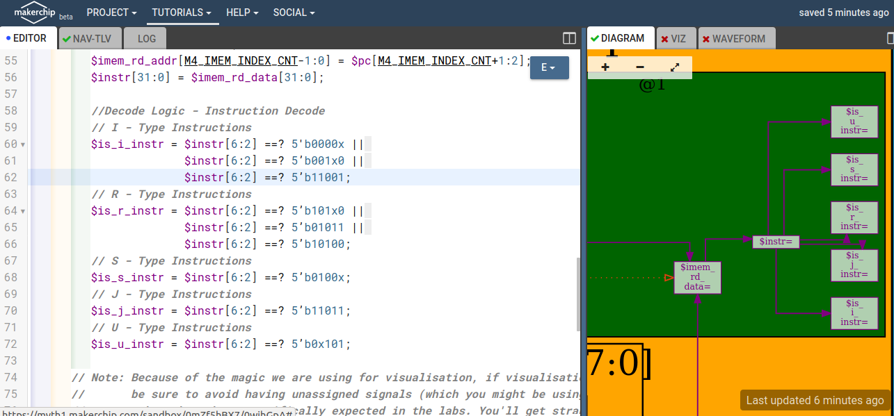

# RISC-V based Microprocessor
RISC-V is a free and open ISA enabling a new era of processor innovation through open standard collaboration. Born in academia and research, RISC-V ISA delivers a new level of free, extensible software and hardware freedom on architecture, paving the way for the next 50 years of computing design and innovation. A number of companies are offering or have already announced RISC-V hardware, open source operating systems with RISC-V support are available and the instruction set is supported in several popular software [toolchains][10].

This repository contains all the information needed to build your RISC-V pipelined core, which has support of base interger RV32I instruction format and testing it with a simple C code using TL-Verilog on [Makerchip IDE platform][9].

[9]:https://www.makerchip.com/
[10]:https://en.wikipedia.org/wiki/Toolchain

# Table of Contents
* [Introduction to RISC-V ISA](#Introduction-to-RISC-V-ISA)
* [About GNU Compiler Tool Chain](#About-GNU-Compiler-Tool-Chain)
* [Introduction to ABI](#Introduction-to-ABI) 
* [Digital Logic with TL-Verilog and Makerchip](#Digital-Logic-with-TL-Verilog-and-Makerchip)
* [RISC-V Core Implementation](#RISC-V-Core-Implementation)
    * [Program Counter](#Program-Counter) 
    * [Fetch](#Fetch)
    * [Decode](#Decode)
    * [Execute](#Execute)
    * [RISC-V Pipelined Core](#RISC-V-Pipelined-Core)
* [Conclusion](#Conclusion)
* [Acknowledgements](#Acknowledgements)
* [References](#References)

# Introduction to RISC-V ISA
An Instruction Set Architecture (ISA) defines, describes, and specifies how a particular computer processor core works. The ISA describes the registers and describes each machine-level instruction. The ISA forms the interface between hardware and software. Hardware engineers design digital circuits to implement a given ISA specification. Software engineers write code (operating systems, compilers, etc.) based on a given ISA specification.

A RISC-V ISA is defined as a base integer ISA, which must be present in any implementation, plus optional extensions to the base ISA. Each base integer instruction set is characterized by

1. Width of the integer registers (XLEN)
2. Corresponding size of the address space
3. Number of integer registers (32 in RISC-V)

More details on RISC-V ISA can be obtained [here](https://github.com/riscv/riscv-isa-manual/releases/download/draft-20200727-8088ba4/riscv-spec.pdf).
# About GNU Compiler Tool Chain
The GNU Toolchain is a popular set of programming tools commonly used in Linux systems. The toolchain contains GNU Make, GCC, GNU Binutils, GNU Bison, GNU m4, GNU Debugger, and the GNU build system. Each of these tools help programmers make and compile their code to produce a program or library. 

Under the risc-v toolchain, 
  * To use the risc-v gcc compiler use the below command:

    `riscv64-unknown-elf-gcc -Ofast -mabi=lp64 -march=rv64i -o <object filename> <C filename>`

    More generic command with different options:

    `riscv64-unknown-elf-gcc <compiler option -O1 ; Ofast> <ABI specifier -lp64; -lp32; -ilp32> <architecture specifier -RV64 ; RV32> -o <object filename> <C      filename>`

    More details on compiler options can be obtained [here](https://www.sifive.com/blog/all-aboard-part-1-compiler-args)

  * To view assembly code use the below command,
    
    `riscv64-unknown-elf-objdump -d <object filename>`
    
  * To use SPIKE simualtor to run risc-v obj file use the below command,
  
    `spike pk <object filename>`
    
    To use SPIKE as debugger
    
    `spike -d pk <object Filename>` with degub command as `until pc 0 <pc of your choice>`

    To install complete risc-v toolchain locally on linux machine,
      1. [RISC-V GNU Toolchain](http://hdlexpress.com/RisKy1/How2/toolchain/toolchain.html)
      2. [RISC-V ISA SImulator - Spike](https://github.com/kunalg123/riscv_workshop_collaterals)
    
    Once done with installation add the PATH to .bashrc file for future use.
# Introduction to ABI 

System programming involves designing and writing computer programs that allow the computer hardware to interface with the programmer and the user, leading to the effective execution of application software on the computer system. In order to achieve systems programming there needs to be an interface which communicates between software and hardware which is where the APPLICATION BINARY INTERFACE comes into play.

Application Binary Interface is an interface that allows application programmers to access hardware resources. RISC-V specification has 32 registers whose width is defined by XLEN which can be 32/64 for RV32/RV64 respectively.The data can be loaded from memory to registers or directly sent, Application programmer can access each of these 32 registers through its ABI name seen below

# Digital Logic with TL-Verilog and Makerchip

## [MAKERCHIP]() 
Makerchip is a free online environment by Redwood EDA for developing high-quality integrated circuits. The online platform can be used to code, compile, simulate and debug Verilog designs all in just one tool. Access and learn from [here](http://makerchip.com/)
   
## [TL VERILOG]() 
Transaction Level Verilog or TL-Verilog is an extension to existing Verilog HDL and a huge step forward in coding HDL languages. TL-Verilog introduces simpler syntaxes and adds powerful constructs which makes Logic Design fun and easy. (Also can say its a Higher Abstraction to Sys V). Generally, high-speed designs are less than half the size in TL-Verilog versus SystemVerilog without any loss in detail! More about it [here](https://www.redwoodeda.com/tl-verilog)
  
 ## [DIGITAL DESIGN]()
  
  Below are a set of images from Makerchip showcasing the TL-V code for Combinational and sequential logic and Simulation Output. Most of the basic circuits examples can be found in Makerchip Tutorials anexhaustive list to get anyone enough information to learn the platform and TL-Verilog.
  
__1. GATES and MUX (AND , OR , NOT etc)__

__2.Sequential Calculator which remembers the last result, and uses it for the next calculation__

  
__3.Pipelined logic__

Timing abstract powerful feature of TL-Verilog which converts a code into pipeline stages easily. Whole code under `|pipe` scope with stages defined as `@?`

Below is snapshot of 2-cycle calculator which clears the output alternatively and output of given inputs are observed at the next cycle.

__4.Validity__

Validity is TL-verilog means signal indicates validity of transaction and described as "when" scope else it will work as don't care. Denoted as `?$valid`. Validity provides easier debug, cleaner design, better error checking, automated clock gating.

Below is snapshot of 2-cycle calculator with validity. 

   
# RISC-V Core Implementation

Designing the basic processor of 3 stages fetch, decode and execute based on RISC-V ISA.

## [Program Counter]()
   The program counter (PC), commonly called the instruction pointer (IP) is a counter in a processor that indicates where a computer is in its program. PC jumps 4bytes at a time as each instruction is 32bits in RV32.

## [Fetch]()

*The instruction fetch unit (IFU) in a central processing unit (CPU) is responsible for organising program instructions to be fetched from memory, and executed, in an appropriate order. This makes the control logic of the core.*

## [Decode]()

*The decoding stage allows the CPU to determine what instruction is to be performed so that the CPU can tell how many operands it needs to fetch in order to perform the instruction. The opcode fetched from the memory is decoded for the next steps and moved to the appropriate registers. Below image shows hoe decode is determining the TYPE OF RISC V instructions set (Various types of Instructions in RV32 are I, R, S, J, U)*

Waveform showcasing BLT signal (Branch if less than) Toggle on Branch Instruction decode. 

## [Execute]()

*An arithmetic-logic unit (ALU) is the part of the CPU that carries out arithmetic and logic operations. Below image shows an ADDI (ADD Immediate) instruction computation.*

*A unique feature of makerchip yet to be released to public is VIZ (Visualization), it helps analyze the implementation visually thereby developers can understand how instructions are executed and which registers is at play during transactions and the final register output.*

## [RISC-V Pipelined Core]()

*Converting non-piepleined CPU to pipelined CPU using timing abstract feature of TL-Verilog. This allows easy retiming wihtout any risk of funcational bugs.

*The Core was enhanced to be staged across multi-stages in a pipeline, Final output where the core is computing Sum of 9 numbers and the code for the same is available [here](https://github.com/RISCV-MYTH-WORKSHOP/RISC-V-Core/blob/master/Day3_5/risc-v_solutions.tlv).*

# Conclusion

This project was done as a part of the [RISC-V based MYTH (Microprocessor for You in Thirty Hours)][3] workshop conducted by Kunal Ghosh and Steve Hoover. The current project implements almost the entire RV32I base instruction set. We capable of executing all RISC-V instructions in four cycles with easy pipelining using Transaction-Level Verilog. TL-Verilog not only reduces your code size significantly but allows us to freely declare signals without explicitly declaring them (just like Python does compare to C). In addition, we can generate Verilog/SystemVerilog code from TL-Verilog in Makerchip IDE which using Sandpiper complier. Future work involves modifying the current design to implement support for the remaining operations and also implementation of other standard extensions like M, F and D.

[3]:https://www.vlsisystemdesign.com/riscv-based-myth/
# Acknowledgements
All this wouldn't have been possible without a great set of mentors guiding throughout the workshop, few notable mentions below

* [Kunal Ghosh][1], Co-founder, VSD Corp. Pvt. Ltd.
* [Steve Hoover][2], Founder, Redwood EDA

[1]:https://github.com/kunalg123/ "Kunal Ghosh"
[2]:https://github.com/stevehoover/ "Steve Hoover"

# References
You can follow the below mentioned sites for more information regarding the particular topics.
* [RISC-V][21]
* [Makerchip Platform][22]
* [TL-Verilog][23]
* [Redwood EDA][24]
* [VLSI System Design][25]

[21]:https://riscv.org/
[22]:https://makerchip.com/
[23]:https://www.redwoodeda.com/tl-verilog 
[24]:https://www.redwoodeda.com/
[25]:https://www.vlsisystemdesign.com/
